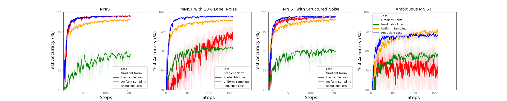
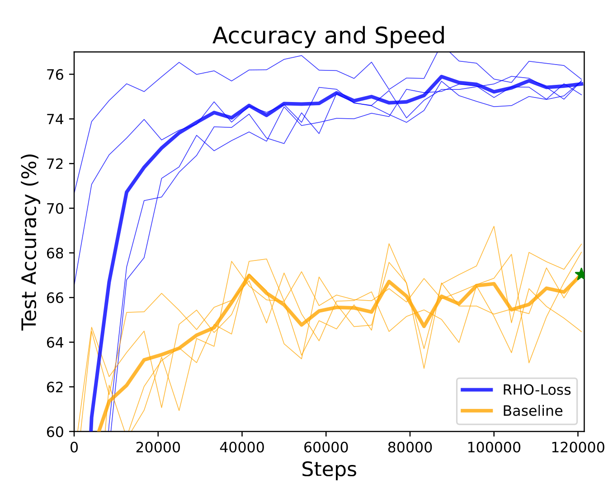
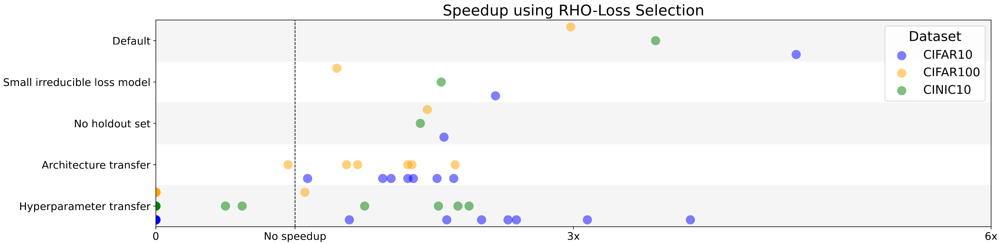

# [Re] Prioritized Training on Points that are Learnable, Worth Learning, and Not Yet Learnt
Repository for reproducing the paper "Prioritized Training on Points that are learnable, Worth Learning, and Not Yet Learnt" by Mindermann et al. for the ML Reproducibility Challenge 2022.

## Installation
The first step is to install the requirements:
```bash
pip install -r requirements.txt
```
## Structure of the Project

This repository has all that is needed to reproduce the RHO-Loss paper.

To reproduce specific parts of the paper you can find scripts in the `src/scripts` folder. For each figure or table there is a seperate folder.
In this folder you can usually find a data generation script which runs the experiment and saves the data in CSV or pickle format. For figures
you can also find a Jupyter notebook to generate the specific figure from the generated data.

### Using the start.py interface

A very simple way to run experiments is the use of the `start.py` python file.
This script provides an interactive CLI-Interface to configure and run an experiment.

To start the interface just type:
```
python start.py
```
After that you will be greeted by a CLI-Interface. You can use the arrow keys and
the return key to select which plot you want to reproduce.

Depending on the experiment the complete experiment can be configured from
this CLI. For other experiments you need to provide a path to a config file which
holds additional configuration like hyperparameters.

Examples for these Configuration files that I used for my experiments can be found
in the folder for the specific figure. Before using please check the config file
and set your paths for the datasets, models, or output.

### Running experiment scripts
Besides that you can also directly use the provided scripts.
You can find these in the `script/figure_x` directory.
For example to generate figure 6 from the paper you can run the `generate_figure_6_data.py` file to generate the data:

```
python src/scripts/figure_6/generate_figure_6_data.py
```

The output will be 4 pickle files which will be the input for `generate_figure_6_plot.ipynb` in the same folder.
The plot then looks like this:



## Models and Raw results
The models and raw results are hosted on Zenodo:

[](https://doi.org/10.5281/zenodo.7578533)

## Results
In this section I want to provide a few results.

### Figure 1


### Figure 2


### Figure 6


### Conclusion
In general I come to the conclusion that the results from the original
paper are reproducible. For more information see the [Reproducibility Report](http://example.com/).

